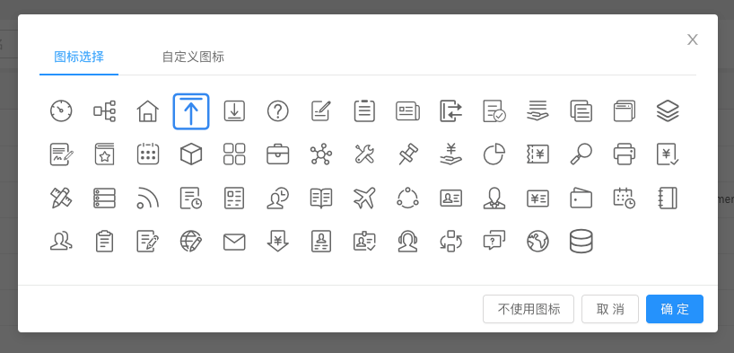

# 前端应用搭建平台用户手册

## 背景

公司4.0项目之后，新项目的前端架构发生了很大变化。在前端work平台的帮助下，4.0前端系统的每个前端页面都可以实现单独部署。
但work平台存在局限性。缺少权限管理，缺少对多系统的支持（work平台仅服务于4.0项目），依赖运维平台菜单服务等问题，都成了work平台的瓶颈。
所以，work平台的升级版，菜单平台服务应运而生。

## 产品简介 

### 什么是前端应用平台服务

前端应用平台提供系统前端平台界面服务，提供包括按产品线+租户定制系统主题风格、LOGO等功能。将原先运维平台中菜单管理服务，与work平台菜单静态资源管理服务整合，提供维护各系统菜单树结构、菜单资源码等信息的能力。各产品线的前端研发不再需要各自搭建复杂的前端框架平台，只需专注于开发各自的前端业务应用。

### 产品优势
+ 帮助研发人员快速构建系统前端框架
+ 支持按使用量弹性伸缩扩展
+ 性能优异, 单节点可支持1000qps

### 产品功能
主要功能特点
+ 提供维护各系统菜单树结构、菜单访问权限控制功能
+ 支持多租户主题风格、LOGO及favicon定制
+ 集成账号管理、消息中心等中台服务

## 产品定价

### 计费方式

当前阶段全部免费。
<!--
|  产品  | 赔偿金额 | 定价维度 | 定价 |
|  :----  | :----  |:---- |:---- |
| 前端应用平台 | 应用|单价|40000/年
| 前端应用平台 | 应用 |定制系统主题风格|20000/套|
-->

### 赔付方案

如服务可用性低于98%，可按照下表中的标准获得赔偿，且赔偿总额不超过在未达到服务可用性承诺期间内的客户实际支付的服务费。
赔偿的服务费作为一下计费周期的费用抵扣。

|  服务可用性  | 赔偿金额 | 
|  :----  | :----  |
| 低于99%但等于或高于98%  | 10%|
| 低于98%但高于或等于95% | 20% |
| 低于95% | 30% |

## 接入条件
+ 获取根据权限筛选后菜单列表的服务依赖企业中台用户中心服务，需要先接入用户中心服务。
+ 后端服务接入中台网关（后端服务未接入中台网关情况下需要额外在paas平台上增加配置）。

## 准备工作
在PAAS平台申请好系统域名(联系人: 李伟)
后端服务接入中台网关（联系人: 黄方）
在PAAS平台的“用户中心”组织中维护域名及路径对应的网络（联系人: 胡佩杰）
以“用户中心”系统为例：


若后端服务暂时未接入中台网关，需要在系统原组织中和用户中心各自维护域名下路径对应的网络。具体联系胡佩杰。

## 服务说明
前端应用平台配置页面部署在业务中台运营平台系统中: http://paas-t.xforceplus.com/business-ui/#/appSetting

### SAAS平台配置管理


要接入中台菜单平台服务，首先需要通过维护域名及其相应的系统名称、启用模块、权限体系、主题风格等信息，将系统注册到SAAS平台配置中。
系统配置信息包括：
+ 启用模块
目前平台提供了账号管理和消息中心模块

   


账号管理模块提供了跳转账号管理的菜单选项，可用于查看、修改账号及密码。
消息中心模块如果启用，需要先接入中台消息中心服务。

+ 权限体系
系统对应的权限体系（与产品线APPID对应）。一般情况只需维护系统对应的产品线即可，如果系统需要引入其他产品线或者业务中台提供的界面，则需要将对应的产品线APPID维护到该系统的权限体系中。
比如华润发票管理系统中既包含通用产品线提供的进销项模块，又包含业务中台提供的组织人员角色管理模块，则华润发票管理系统对应的权限体系就需要添加通用产品线和用户平台。

+ 主题风格设置

+ LOGO与favicon图标设置

+ 租户定制
  提供对指定的租户定制主题风格及图标

### 菜单管理


业务中台的菜单管理界面提供了以下功能：

+ 按系统维护菜单信息
可按不同系统维护所属的菜单信息。后续版本将添加权限控制，根据登录账号提供可选择的系统。

+ 维护菜单对应的资源码
提供维护菜单与资源码的关系。需要使用业务中台用户中心的资源码体系。

+ 菜单的停用与启用
可停用暂时不对外显示的菜单，但不做删除，以备后续启用。

+ 菜单图标设置
提供了一组默认的菜单图标库供选择



后续版本会与设计团队打造适合公司业务的菜单图标库。

+ 页面发布版本号查看
可查看菜单与前端项目对应的版本号，方便确认当前菜单页面的代码版本。

## 研发人员需知

### 脚手架支持
目前公司前端的脚手架sanctuary-cli@4.0.0已支持生成基于前端应用平台的单页应用初始化模板。


对于搭建一个全新的系统而言，只需要完成以下几个步骤：

* 申请域名
* 在saas平台配置页面维护域名对应的系统相关信息。
* 在菜单管理页面维护系统包含的菜单信息。
* 在gitlab中创建页面对应的仓库后，使用脚手架生成单页应用初始化模板代码。
* 首次push代码后，在业务中台菜单管理页面，将菜单的项目名改为PAAS平台生成的RELEASE_NAME，部署之后即可通过菜单平台应用看到相应的页面。

脚手架的使用帮助见[前端脚手架帮助文档](assets/fgimage/fgstaging-v6-20191023_101714.pdf)

### gitlab-ci.yml文件配置
基于中台菜单服务的系统中，所有前端模块项目根目录下必须包含.gitlab-ci.yml文件。这一步sanctuary-cli@4.0.0脚手架会帮助你完成，但也请确保这个文件不会被改动。
对于需要对接菜单管理服务的现有react单页应用模块，也只需要将.gitlab-ci.yml中的代码替换成以下代码即可。

<!--yml-->
```yml
// .gitlab-ci.yml文件内容
include: 'http://gitlab4.0.xforceplus.com/common/react-gitlabci4-minio/raw/dev/ci/.gitlab-ci.yml'
```

封装后的ci脚本会帮我们在paas平台上做好所有准备部署的工作。

### 菜单项目名确认
前端模块部署成功后，paas平台会将打包后的静态资源文件地址回写到菜单管理服务。但是，在部署之前，请确保菜单的项目名与paas中的release-name一致，见下图


前图为paas平台发布配置，配置中的env.open.release_name就是菜单项目名。后图为企业中台菜单管理界面。

### 前端模块paas部署配置
除了前端模块项目的release_name与对应的菜单项目名保持一致外，paas平台发布配置中的worker_platform_url_*配置项也需要注意。

paas平台部署前端打包资源成功后，会根据worker_platform_url_*对应的地址调用菜单资源回写服务。目前中台菜单资源回写服务的fat环境地址是http://paas-t.xforceplus.com/app/global/configuration/v1/app-config/menu-resources，PROD环境地址是：http://paas.xforceplus.com/app/global/configuration/v1/app-config/menu-resources

前端静态资源(.js, .css, ...)会被部署在阿里云上管理。

## 属地部署

属地部署时，前端静态资源可能因为网络限制，不允许部署到阿里云。需要在属地环境自建minio静态文件服务以及nginx代理服务，前端应用部署时，将静态资源传到minio服务器统一管理。所以ci脚本及部署配置需要有所调整。

.gitlab-ci.yml中的代码替换成以下代码：

<!--yml-->
```yml
// .gitlab-ci.yml文件内容
include: 'http://gitlab4.0.xforceplus.com/common/react-gitlabci4-minio/raw/new-dev/ci/.gitlab-ci.yml'
```

paas部署配置：


其中WORKER_PLATFORM_URL_*为前端静态资源地址回调服务， SUB_PATH为nginx访问前端静态资源路径地址，MINIO_URL_LOC为minio服务地址，BUCKET_LOC对应静态服务器上申请的bucket

## 联系方式
tower@xforceplus.com